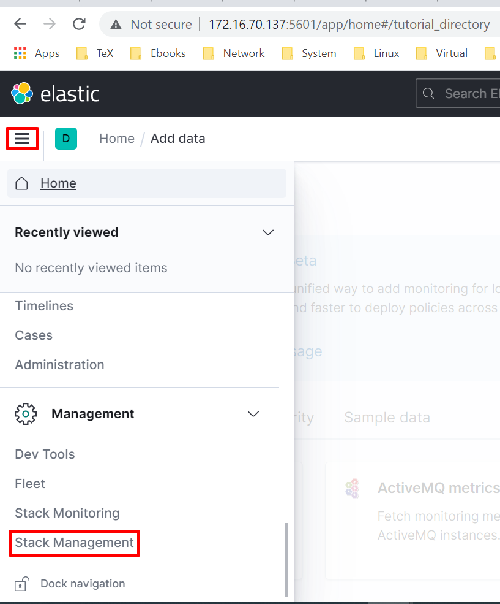
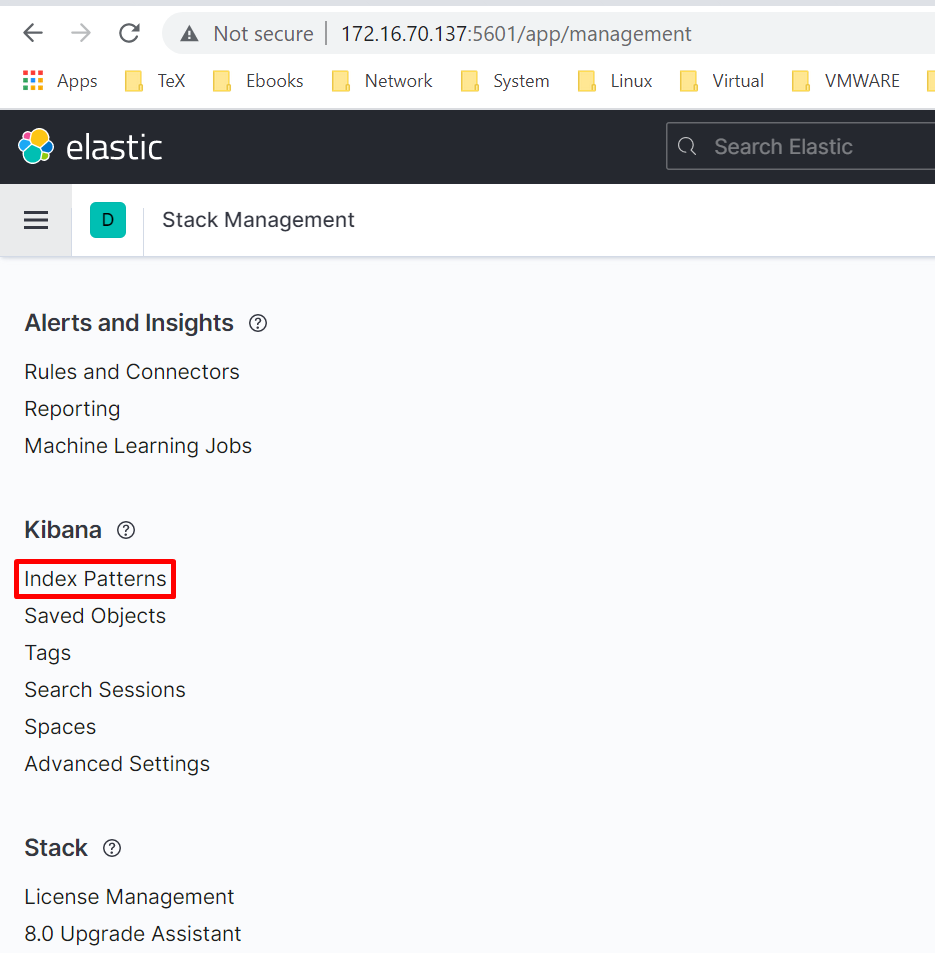

# Hướng dẫn cài đặt ELK

Chuẩn bị môi trường cài đặt ELK để thực hành.
- Hệ điều hành: Ubuntu Server 20.04 64 bit.
- ELK Stack: Phiên bản 7.10.x trở lên.
- Cài đặt ELK theo phương án manual hoặc trong môi trường container.

# Các bước cài đặt 
- Cài đặt máy chủ với OS là Ubuntu Server 20.04 64 bit.
- Thiết lập IP, Hostname.
- Cấu hình NTP và kiểm tra thời gian cho phù hợp giờ VN.

Lựa chọn một trong hai phương án cài đặt sau:
- Cài bằng docker-compose hoặc cài theo kiểu manual.
- Đọc hướng dẫn dưới và lựa chọn một trong 2 phương án.

## Cài đặt ELK

Để thực hành với Elastic thì chỉ cần cài Elasticsearch là đủ, nhưng trong hướng dẫn này sẽ thực hiện cài đủ Elastic, Logstash và Kibana.

### Phương án 1: Cài bằng docker-compose.

Sử dụng docker-compose sẽ giúp linh hoạt, nhanh chóng có một môi trường ELK để thực hành.

- [Xem hướng dẫn tại](https://github.com/hocchudong/ghichep-ELK/tree/master/elk-docker)

### Phương án 2: Cài manual.

Với cách cài này, có thể tăng tốc thời gian bằng việc sử dụng script cài đặt.

- [Sử dụng script cài đặt ELK tại](https://github.com/hocchudong/ghichep-ELK/blob/master/scripts/readme.md)

Sau khi cài đặt xong, kiểm tra trên CLI hoặc vào web để xem ELK hoạt động hay chưa.

CLI: Sử dụng lệnh CURL để kiểm tra hoạt động của elasticsearch
    ```
    root@ubuntu20-04:~/ghichep-ELK/elk-docker# curl http://172.16.70.137:9200
    {
    "name" : "hcd-demo-es",
    "cluster_name" : "es-docker-cluster",
    "cluster_uuid" : "kYU922NfRSeTkfzGaHz1tg",
    "version" : {
        "number" : "7.13.2",
        "build_flavor" : "default",
        "build_type" : "docker",
        "build_hash" : "4d960a0733be83dd2543ca018aa4ddc42e956800",
        "build_date" : "2021-06-10T21:01:55.251515791Z",
        "build_snapshot" : false,
        "lucene_version" : "8.8.2",
        "minimum_wire_compatibility_version" : "6.8.0",
        "minimum_index_compatibility_version" : "6.0.0-beta1"
    },
    "tagline" : "You Know, for Search"
    }
    root@ubuntu20-04:~/ghichep-ELK/elk-docker#
    ```

Web: Truy cập vào web với địa chỉ: http://IP_ADD:9200 để xem trạng thái của elasticsearch.
    ```
    [Anh](https://image.prntscr.com/image/m9fYZ77LT8msu1xXCPyNIQ.png)
    ```


### Nạp dữ liệu vào ELK.

Sau khi cài đặt xong ELK, thực hiện các thao tác dưới để nạp dữ liệu vào Elastic.

Trước tiên, cần khai báo mapping cho index. Việc này giống như chúng ta tạo các bảng trong SQL truyền thống. Tức là sẽ định nghĩa các dữ liệu sau này được nạp vào có kiểu là gì: kiểu số, kiểu chuỗi ...

-  Di chuyển về thư mục root
    ```
    sudo su

    cd /root
    ```

- Tạo file với tên là `shakes-mapping.json` tại thư mục `root`. Dùng vi hoặc nano để tạo file với nội dung dưới.
    ```
    {
        "mappings" : {
            "properties" : {
                "speaker" : {"type": "keyword" },
                "play_name" : {"type": "keyword" },
                "line_id" : { "type" : "integer" },
                "speech_number" : { "type" : "integer" }
            }
        }
    }
    ```

- Thực hiện sử dụng lệnh CURL để tạp mapping cho index có tên là `shakespeare` theo lệnh dưới.

```
curl -H 'Content-Type: application/json' -XPUT 127.0.0.1:9200/shakespeare --data-binary @shakes-mapping.json
```

- Tải file chứa dữ liệu mẫu và import vào index `shakespeare` vừa tạo mapping ở trên.
    ```
    wget https://github.com/hocchudong/ghichep-ELK/raw/master/elk-hand-on-lab/files/shakespeare_7.0.json
    ```

- Thực hiện import dữ liệu vào index `shakespeare`
    ```
    curl -H 'Content-Type: application/json' -X POST 'localhost:9200/shakespeare/doc/_bulk?pretty' --data-binary  @shakespeare_7.0.json
    ```
Màn hình sẽ hiển thị quá trình import, chờ trong khoảng vài phút dữ liệu được import vào hết, ta sẽ kiểm tra trong giao diện hoặc dòng lệnh để xem dữ liệu đã hiển thị lên chưa.

Kiểm tra dữ liệu bằng dòng lệnh.

- Tiếp tục sử dụng lệnh curl, kiểm tra thông qua API của elastic xem dữ liệu đã được nạp hay chưa. Hãy copy đoạn lệnh dưới vào CLI và quan sát kết quả.

```
curl -H 'Content-Type: application/json' -XGET '127.0.0.1:9200/shakespeare/_search?pretty' -d '
{
"query" : {
"match_phrase" : {
"text_entry" : "to be or not to be"
}
}
}'
```

- Kết quả của lệnh trên như sau là ok.
    ```
    {
    "took" : 84,
    "timed_out" : false,
    "_shards" : {
        "total" : 1,
        "successful" : 1,
        "skipped" : 0,
        "failed" : 0
    },
    "hits" : {
        "total" : {
        "value" : 1,
        "relation" : "eq"
        },
        "max_score" : 13.889601,
        "hits" : [
        {
            "_index" : "shakespeare",
            "_type" : "doc",
            "_id" : "34229",
            "_score" : 13.889601,
            "_source" : {
            "type" : "line",
            "line_id" : 34230,
            "play_name" : "Hamlet",
            "speech_number" : 19,
            "line_number" : "3.1.64",
            "speaker" : "HAMLET",
            "text_entry" : "To be, or not to be: that is the question:"
            }
        }
        ]
    }
    }
    ```


Kiểm tra thông qua GUI của Kibana.

- Truy cập vào địa chỉ http://172.16.70.137:5601


- Chọn `Add data`


- Chọn biểu tượng Menu => `Stack Management`
{:height="50%" width="50%"}


- Chọn `Index Partterns`
{:height="50%" width="50%"}


